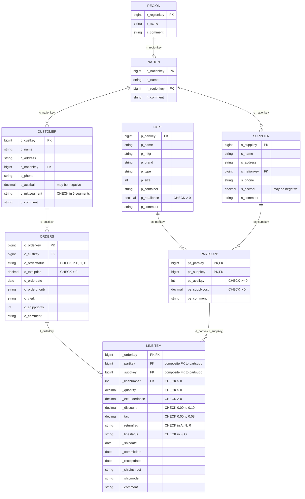

# Silver Layer — ER Diagram

Schema: `group1_finance.silver`. Built by [`notebooks/02_silver.ipynb`](../notebooks/02_silver.ipynb).

All `decimal` columns are `DECIMAL(18,2)`. Keys, foreign keys, monetary columns, dates and finance-relevant flags are `NOT NULL`; descriptive text columns are nullable.

`lineitem` does **not** reference `part` and `supplier` separately: it references the `(ps_partkey, ps_suppkey)` pair in `partsupp`, so a line item can only use a supplier that actually offers that part. Valid part and supplier keys on their own do not satisfy it.

Rows that fail any rule are written to `silver.quarantine`, which is outside the model and has no relationships.

## Screenshot for the presentation

GitHub renders the diagram above. To get an image of it:

- **Databricks:** *Catalog Explorer → group1_finance → silver → lineitem → View relationships*. This draws the ER diagram from the PK/FK constraints that `02_silver` registers in Unity Catalog.
- **Mermaid:** paste the block above into <https://mermaid.live> and export it as PNG or SVG.
